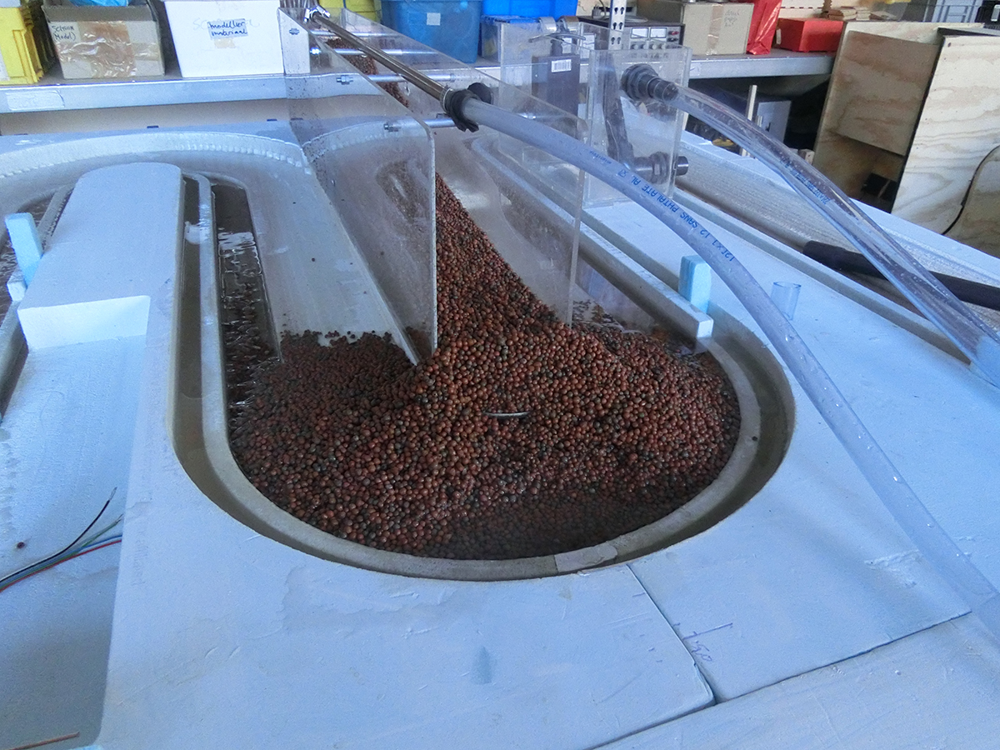
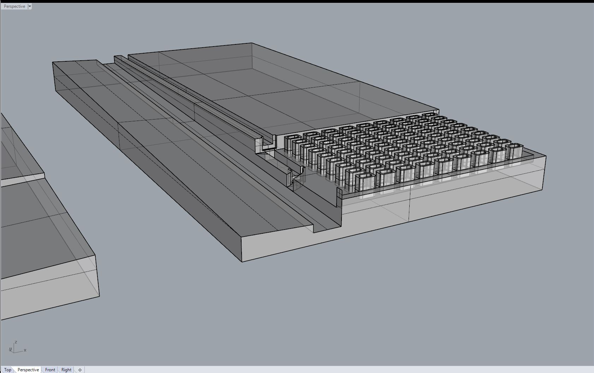
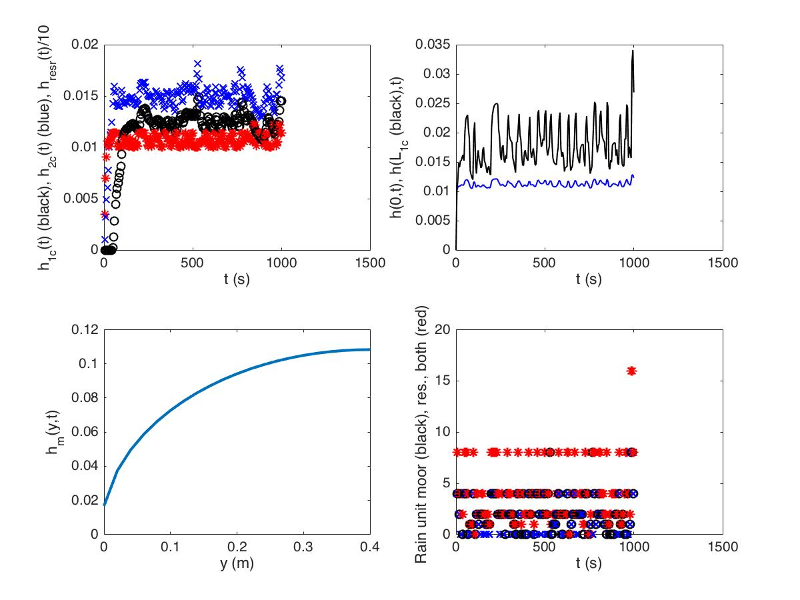
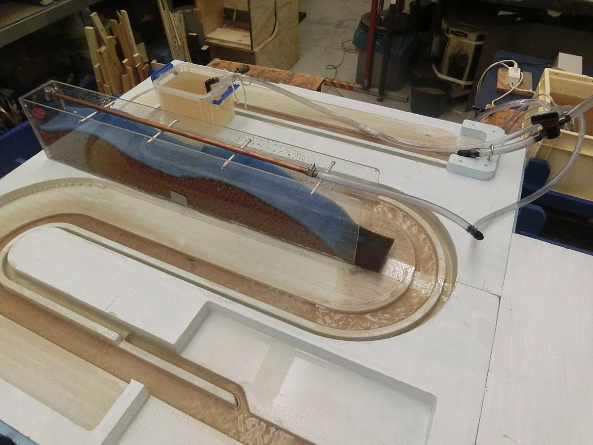

# Wetropolis Design 2016-2019


## Design files for Wetropolis Flood demonstrator

## Design foam plates 2016 CAD files

## Arduino board and codes for automated internal Galton boards 2016

## Arduino boards routing CAD and codes for two Galton boards 2016-2018


## Matlab file of matematical and numerical design model 
Created 28-05-2016 for seminar at 01-06-2016 and first version completed 08-06-2016; contined further till 19-02-2016. Old version 05-06-2016: tabletopt1v2016.m (probably with infamous error). Newer/newest version: tabletopt2v2016.m


# The story of Wetropolis' flood demonstrator by Onno Bokhove

While compilating the design files, I searched through my email accounts and realised how the Wetropolis idea gradually grew to a definite design in a couple of email exchanges with Wout Zweers as well as to two or three presentations:
- one ``Managing Risk in an Age of Extremes'' at the Science of Flood workshop on May 8th 2016 in Hebden Bridge --see the file hebdenbrigde2016 -copy.pdf Notice the first design sketch on page 18 and that the final design became quite different.
- an Email exchange with Dr COlin Cotter in which I promised a presentation and send him an abstract on 08-05-2015, while I had not done any mathematical calculations yet. Talke about managing risk in the age of extremes!
"Sun 5/8/2016, 9:09 PM
colin.cotter@imperial.ac.uk Hi Colin, Would the following work for the June 1st seminar for MPE? Bit "experimental/preliminary" but I think I have enough for a good overview and discussion. Besides it coincides with the writing of the outline. Let me know your comments before I send it to Anna, please. --Onno

On the Science of Floods: Rainfall, Flooding, and Flood Control revisited in the Design of a Table-Top Model By Onno Bokhove School of Mathematics University of Leeds
 
In a recent public event in Hebden Bridge, a town in Yorkshire that has seen a lot of sustained and flash floods over the last decade, I addressed the following questions:
- Is it going to rain more in the future?
- Can we define extreme precipitation and flooding events?
- How (well) can we predict heavy precipitation and floods?
- How (well) can we mitigate and control flooding?

I will elucidate the answers to the above questions and use them in the design and modelling of an interactive, conceptual table-top demonstration and experiment on rainfall, flooding as well as flood mitigation and control. The design will serve two purposes: as public demonstration of the concepts of flooding and as a simplified test environment for mathematical models of flooding with rainfall, hydraulics, hydrology, data assimilation and flood control. For the test environment, I will identify the mathematical elements involved to model ``random’’ rain supply, channel/river flow, the hydrology of ``Hele-Shaw valleys’’ (illustrating the effects porous moors, fast run-off from tarmac, and the function of reservoirs), flow in bypass canals, and control features such as weirs and sluice gates as well as data assimilation using a few measurement points. Obviously, this is work in progress.

- Email from Wout on 30-05-2106: "Maak ook maar zo’n model voor Twente. Er viel hier net 20 mm in 15 minuten. Zelfs de straat stond blank, ondanks de hoge ligging en vlak voor de keukendeur was het 5 cm diep water. En er komen nog een paar buien aan, wow!"
Please also make a mathematical model for Twente. Rain fell, 20mm in 15min. The street was flooded, despite its higher situation and in front of the kicthen door the water was 5cm deep. More rain is expected. Wow!

- Email Wout 31-05-2016: "ik heb al materiaal gekocht. slang, klep, dik schuim, iets om detector mee te maken. "Materials have been bought: tube, valve, thick foam and something to amke a detector."

- Email Wout 04-06-2016: Plaatje freesmodel. The first deisgn was on one foam plated with a DDR-style city. We routed it but it was abandoned since the channel and residence time was too short. See file (```Figovers''') overstromingsmodel-rendering-03.JPG


- A simple water level indicator and pump controller using arduino and a relay: https://youtu.be/JJllc2UXyt8

- one ``'On the science of floods: rainfall, flooding and flood control revisited in the design of a table-top model' at Imperial College on 01-06-2016, where the first completed mathematical and numerical desig model was revealed --see the file reading1J2016.pdf At this seminar, I ran the matlab simulation at the end of the seminar for 100 Wetropolis days, i.e. 1000s real time, which is about 100s computational time. While there should be 2.73 extreme events on average over 100 wd's, in that simulation it was not till day 99 that the first extreme rainfall event and flooding happened. Meanwhile I was babbling for 99s for the extreme event to appears, sweating buckts thinking that I had set up the simulation incorrectly. Then on day 100, bang, the extreme flooding event flooded the city. "Did you keep us in suspense on purpose, had you arrange this", I recall prof Dayl Holm asking. "Sure", I said, and smiled: "I did not. I was swaeting buckets that something went wrong but, hey, that is probability for you". I think I saved a screen shot of this simulation with one spike on wd 99. See, indeed, the file (```simu''') simulator11ic.jpg


- The test results of the first asymmetric Galton board (email Wout 30-06-2016): "Ik heb de aantallen even opgeteld. Na 10 x 16 kogels laten rollen:
28           79           44           9 Uit kansverdeling:
30           70           50           10 Dus dat ligt aardig in de buurt"
 
- 4 drawings/excel files of 2016 base plates (Email 07-07-2016 Wout) all dated with "20160707" in the file name  

- Galton board test 15-07-2016: https://www.youtube.com/watch?v=FR3QPHajcew&feature=youtu.be

- 21-07-2016 email Wout: the wooden support frame is getting together; JPG-files started with 210702016 "Transportabel: alles kan goed uit elkaar, worden latten met wat uitstekende klampen in een rchting, dus goed te bundelen.  grootste lengte: 180 cm lat 8 boutjes m6 om het vast te zetten de latten grijpen in elkaar en worden met een boutje geborgd (zie foto). gewicht: zal ik nog wegen". Transportable. Reporting on dimensions and weight in orde rto assess whether constructions fits in the back of a car --with backseat folded down.

- It is a race against time. Test of river pump on 08-01-206: https://www.youtube.com/watch?v=GVCFESyP-mU&feature=youtu.be
"filmpje met eerste water in model. rivier stroomt over bij debiet 1040 l  per uur., water in stad staat dan tot de rand waar de uiterwaard begint. ik ga er een (instelbaar) 220 v pompje voor halen, ik heb nu 3 stuks  12-V pompjes nodig (op 14 V, dat houden ze niet lang vol) om dit debiet  te halen. rondpompen gaat verder goed, ik heb een retourpomp op 220 v welke het uitgestroomde water oppompt vanuit een teil / emmer op de bodem naar de  bak waar de 12 v pompen in hangen (zo min mogelijk opvoerhoogte, maakt  het voor de pompen makkelijker om voldoende debiet te geven). het pompje zal regelbaar zijn, zodat we de gewenste hoeveelheid ook  vantevoren in kunnen stellen." Top view "overstromingsmodel test rivierpomp bovenaanzicht 1 aug 2016": https://youtu.be/QiVPV9ntBt0 The seams between two foam plates and the aluminium tape sealing them is seen nicely in here "overstromingsmodel test rivierpomp cyclus 1 aug 2016": https://youtu.be/Hwd3rjfHjkE
- Rain box tests 04-08-2016: https://youtu.be/cTSCZrBgIYs (and more rain https://youtu.be/cTSCZrBgIYs), and tests Galton boards (with error in bottom one  -later replaced): https://youtu.be/zMG5POaJsHE

- And comparing my calculations of rainsupply with what was measured: "mijn calibratie kwam uit op 0.94 l in 10 sec. spot on dus. Op 4-8-2016 om 15:18 schreef Onno Bokhove: 1, 2, 4, of 8 R0/s over 10s unit. In mijn model had ik 0.12, 0.24, 0.48, 0.96 liter over 10s, en dus over twee cellen kan dat zelfs 2x0.96 liter zijn. Edoch mijn model is slechts indicatief." Wout: "de pomp werkte bij 8 v en gaf 336 l per uur. bij 12 v, net ook even getest,  kom ik op 550 l per uur. net voldoende denk ik, want bij 1000 liter per uur stroomde bedding net niet over bij de stad. dit getal klopt wel zo'n beetje met de eerdere tests van de dompelpompje: rond 500 liter per uur maximaal. De pomp stond op 8 v, ik kan continu bedrijf (12 v)  max een half uur gebruiken. Mocht het toch te weinig zijn dan stap ik ook hier over op een 220 v pompje, voor ongeveer 25 euro heb je ruime keuze in debieten en geen gedoe met hoog amperage voeding voor 12V. het wordt toch via een relais aan uit geschakeld."

- Wout 11-08-2016: "Vandaag hydrokorrels gebruikt (grote maat, kon in de stad geen kleine  krijgen), valt niet tegen. Het gaat niet opdrijven, blijft goed in de  vorm. Het stroomt wat snel door en de vertragende werking en bergingscapaciteit komen niet zo duidelijk naar voren, maar nalopen  nadat de regen stopt is wel duidelijk te zien. Het vult tot ongeveer 7  cm hoogte met water bij ingestelde debiet, daarboven is het onverzadigd. Ik denk dat ik morgen wat fijner materiaal ga halen bij een tuinzaak, in  de stad hadden ze het niet. Wel heel fijn materiaal (leisplit en zand) maar dat stroomt niet snel genoeg door en dan krijg je vooral runoff. Daarmee kan ik dan wat beter kijken naar de respons op een regenbui,  karakteristieke tijd, waterweerstand van het geheel maar zo, op gevoel, werkt het ook al aardig. De kraan voor het instellen van het rivierdebiet werkt goed, ruime  variatie mogelijk. Voor het reservoir heb ik nu een bakje met 2.5 liter gebruikt, dat was  voorhanden, maar lijkt een bruikbare grootte te zijn Bij leeggieten en moor aan krijg je geheid een overstroming, als je het leeggiet en de moor staat niet aan / druppelt niet na dan loopt de rivier vol en overstroomt wel in de iuterwaard maar Leeds blijft droog. Beetje mee spelen dus, wat gevoel voor krijgen. Moor aan en reservoir overdoen  geeft een flinke overstroming, maar pas nadat de bergings van de rivier met uiterwaard zelf ook gevuld is. Voor het reservoir wil ik ook een plexiglas bak lijmen, en er een flinke  schuifafsluiter op zetten. Goed voor morgen. Alternatieve materialen zijn overigens: glasparels (straalkogels) van  1.5 a 2 mm, keramische ringetjes (filtermateriaal voor koivijvers), kunststof straal grit (ongeveer 1.5 - 2 mm diameter). Op naar huis nu, het is alweer laat." Final set-up (```fin1108'''):


