# Wetropolis Design 2016-present & Wetropolis spin-off projects (scroll down)

## Introduction
The Wetropolis flood demonstrator is a conceptual, physical installation showcasing what an extreme rainfall event is and how such an event can lead to extreme flooding of a city. A layman's introduction to Wetropolis is found in the following blog:
https://research.reading.ac.uk/dare/2017/07/25/wetropolis-flood-demonstrator/
Please read the blog first. Wetropolis is best experienced in person but, second best, please watch the following movies (from 30-08-2016):
- Exploring Wetropolis (movie for everyone October 2022): https://www.youtube.com/watch?v=rNgEqWdafKk
- News item October 11, 2022: https://mpecdt.ac.uk/exploring-wetropolis-an-extreme-rainfall-and-flood-demonstrator/
- a test to give a first impression https://youtu.be/1FIHFOn6IPQ
- the equivalent of the River Aire Boxing Day flood of 2015 with city flooding resulting from two wd's (one Wetropolis day wd=10s) of consecutive extreme 90% rainfall (so 18s of rainfall in 20s) https://youtu.be/N4Sp5gHXcz4
- EGU highligh article, peer-reviewed in international scientific journal (under education & communication): https://www.hydrol-earth-syst-sci.net/24/2483/2020/ (also read the interesting discussions under "Peer review")
- Impact Case Study Research Excellence Framework UK: "Flood mitigation: from outreach demonstrator to a graphical cost-effectiveness diagnostic for policy makers" 2021/2022. https://results2021.ref.ac.uk/impact/0ad7c1be-8e91-4aac-ab57-6c1e873cd3f1?page=1&fbclid=IwAR0l2_YmgcmEUWvgHwyMR0WyxJsaL3qM7L92fZ-qFkjzq_-JEAyDDnSTqbw" 
- Feedback from showcasings is found in the feedback folder: https://github.com/obokhove/wetropolis20162020/tree/master/feedback
- People travel around and showcase Wetropolis upon request and, these days, with adequate social distancing. Just contact us: onnobokhove@gmail.com (UK) & zweers@dds.nl (NL)


Wetropolis-I consists of several elements which we describe next:
- The topographic landscape with a winding river channel, one-sided flood plain, canals and the city-plain has been routed out of two standard polystyrene foam plates each of dimension 5x60x120xcm<sup>3</sup> (plus a small extra foam plate) with an overlay to fit two plates together. A smaller third piece was added to extend the river length after the city which enhanced flooding in the city plain. Drawings have been made in the CAD programs Rhino/Grasshopper and used to steer the router. Routing precision is circa 0.8mm. After the routing, the river channel and its flood plain have been roughened by gluing fine sand to the base, after which it has been varnished with yacht varnish. Specs: https://www.gamma.nl/assortiment/isolatieplaat-polystyreen-xps-120x60x5-cm-4-stuks/p/B133540 Isolatieplaat polystyreen XPS 120x60x5cm<sup>3</sup>
- A framework of wooden support slabs has been made that fits on four A-frames. This framework is put together with a bolt-nut system such that it can be disassembled for transport. Wooden wedges are used to squeeze and level the foam pieces within the slab-framework. The three foam pieces are squeezed together to limit leakage.  Aluminum one-side-sticky tape is used locally to seal two sections of the river channel together and thus bridge two adjacent channels. Rather than sealing off all leakage, which in practice becomes impossible, an "aquifer" system of two interconected gutters underneath the seams of the foam pieces leads leaked water back to the holding resevoir with the three aquarium pumps. Hence, the water budget is closed in the absence of evaporation, the latter which is negligible on the time scale of operation, of typically one to a few hours.
- Three aquarium pumps with a maximum pumping capacity of 0.375ml/s are placed in a holding reservoir, a rectangular bucket with dimensions ~0.3x0.40x0.22m<sup>3</sup>, which bucket is hung under the wooden framework in a rectangular area adjacent to the upstream inflow point of river water. Plastic tubing with inner and outer diameters of circa (1.8,2.2)mm leads the water from this reservoir to the upstream point and, depending on wether it rains or not, to the reservoir and the moor. Rainfall in the moor is spread out and visualised using a copper pipe with numerous downward-facing holes over the lava grit. Specs: Syncra 1.5, 234-240V, 50z, 23W, Q-max=1350l/hr, H-max=1.8m.
- The moor unit is made of acrylic and on the open side-face of the box a gauze prevents the lava grit from avalanching into the river. The acrylic reservoir is open from the top and water can enter through a hole near the top edge. Outflow of water in the river is regulated via an internal pipe which outflow level can be manually adjusted. Hence, active flood control can be demonstrated by manually adjusting this outflow level. Via an adjustable valve, outflow into the canal can be arranged separately. Note that this is slightly different from the set-up in the mathematical and numerical design model, where the outflow of moor water was partitioned between the river and canal.
- The set-up for the Galton boards including the Galton boards themselves, the accompanying Arduino control units, power sockets and plugs to operate the three aquarium pumps. The two draws from the discrete probability distribution are either computer generated or determined from the random paths of (a) steel ball(s) through the two asymmetric Galton boards. In the latter case, the steel ball triggers a signal by interupting optical sensors in one of the four channels on each Galton board. The signal subsequently steers either the reservoir pump, moor pump, both or none as arranged via the Arduino technology.
  
What follows next are:
- links to other sites with some material, partly duplicated here,
- links to the matlab design codes,
- technical specs of programs used in the routing and the router,
- information and files on the arduino design,
- funding acknowledgments and references, and
- the more-or-less chronological story of the creation of Wetropolis; it contains the basic information, often *in Dutch* (i.e. in italics), with accompanying translation/adaption in English, of various steps and issues we faced in the design. This information may later be ordered differently. Suggestions and questions are welcomed.

## Location of design files for the Wetropolis Flood demonstrator
The original design files for the Galton boards are found at https://grabcad.com/mylibrarymodels search for Wout Zweers and then Galton board 2016. Note that there are 2018 updates used for a new Wetropolis design. For the landscape CAD designs see https://github.com/zweers but some files have been or will be redeposited here as well in the folder topodrawings e.g. image (```sketchbase```) with on the left measurement points indicated which are given in the excel file. 


## Matlab file of mathematical and numerical design model 
The first code was created between 28-05-2016 and 01-06-2016 for OBs seminar at Imperial College on 01-06-2016. This first version was completed on 08-06-2016; continued further till 19-02-2018. The old version from 05-06-2016 is ```Codes/tabletopt1v2016.m``` (probably with the infamous error) and newer/newest version is ```Codes/tabletopt2v2016.m```. Version-3 from March 2019 contains simple label changes from curvilinear along-river coordinate x to s, see ```Codes/tabletopt3v2019.m```, to streamline notation in the article.

## Topographic landscape polystyrene plates, CAD files (2016)
The CAD programs used are the following: Solidworks for designs, saved as Step file for import in Rhino (V5); plugin in Rhino for routing: Rhinocam 5, which generates routing/freesfiles (NC files); routing is done on a BZT 1400 PF router/frees with Winpc-nc driver.
Browse the date-marked files in ```/figs``` folder for a photographic tour of the design. See the readme in the topodrawings directory.

## Arduino board and codes for automated internal Galton boards (2016-2018)
See file: arduinofil/schakelaar_kogeltjes_galtonboard-V0.12-30_aug_2016.ino (30-08-2016) and arduinofil/galton_board_november_2016-V02.1.ino (November 2016).
The print designs for the Arduino boards are found as pdf and dxf files dated 12-11-2016 (layoutprintplaatgaltonboard12nov2016.pdf and layoutprintGB12nov2016zwarteprintlijnen.dxf) See the readme in the Arduino2018 directory and the arduinofil directory for more details.

## Funding
The first version of Wetropolis was an outreach project within the EPSRC Network Maths Foresees EP/M008525/1 (2015-2016); the outreach project funded Tom Kent and Wout Zweers, circa 10k plus travel and transport and 2.5k for an update of the Galton boards (2017/2018).
A summary report from May 2018 is found under outreach projects here: http://www1.maths.leeds.ac.uk/mathsforesees/projects.html and here: http://www1.maths.leeds.ac.uk/mathsforesees/outreachprojreportwetropolis20162017.pdf
<!-- The writing of the journal paper and the creation of this github in 2019 falls under the EU project "Wetropolis: tangible education and watermanagement", see https://www.wetropolis.nl
The Natural Flood Management Wetropolis flood demonstrator, in short Wetropolis NFM, is to date (March 2019) under construction, and received funding from the CDT in Fluid Dynamics (Leeds), JBA Trust, the School of Mathematics and the School of Civil Engineering from the University of Leeds. Wetropolis NFM contains different elements: foam plates, FisherTechnique marble run and Arduino by Wowlab (Ir. Wout Zweers), Hydrotec Consultants Ltd (Leeds-Bradford), with assistance and direction by OB. More on Wetropolis NFM below.

Work Jan-June 2019:
- establishing this GitHub-site such that the Wetropolis flood demonstrator design is a) reported & b) can be used by others for modification & inspiration with Wout Zweers (Jan-March 2019);
- write-up & submission of scientific article on Wetropolis (outreach & education), presently submitted to HESS; see link below under references (Jan-March 2019)
- creation of poster for presentation at EGU2019 in Vienna with Bokhove, Kent, Zweers and De Poot (March-April 2019); and,

(ii) Work Aug-Oct 2019:
- further work on Wetropolis NFM modification & improving the Galton boards with Wout Zweers (continued till Sept 2019);
- work with Wainfleet Flood Action Group, invitation & report --see report below with input from Wout Zweers (Aug 2019); -->

Future possible plans:
- Making a groundwater Wetropolis with Galton boards & (two) conceptual groundwater cells, concerning groundwater flow below Enschede;
- promoting & refining the Galton boards further; and,
- further mathematical & numerical modelling;
- work with Wainfleet Flood Action Group, invitation & report --see report below with input from Wout Zweers (Aug 2019).

## References
- O. Bokhove, T. Hicks, W. Zweers and T. Kent (2020) Wetropolis extreme rainfall and flood demonstrator: from mathematical design to outreach and research. *Hydrology and Earth System Sciences*. https://www.hydrol-earth-syst-sci.net/24/2483/2020/ (```wetroarticle```)  See also 2019 preprint: https://eartharxiv.org/59ymk/
Revised version found above as: (```wetroarticlerevised```)  and (```wetroarticlerevisedno2```) 
- O. Bokhove (2018) Wetropolis flood demonstrator. Final report EPSRC Maths Foresees network outreach project: http://www1.maths.leeds.ac.uk/mathsforesees/outreachprojreportwetropolis20162017.pdf
- O. Bokhove (2017) Wetropolis flood demonstrator. Blog in Data Assimilation of the Resilient city -DARE- project: 
https://research.reading.ac.uk/dare/2017/07/25/wetropolis-flood-demonstrator/
- O. Bokhove, T. Kent, M. Kelmanson, G. Piton, J.-M. Tacnet 2019: Communicating (nature-based) flood-mitigation
schemes using flood-excess volume. River Research and Applications 35, 1402-1414 (open access). Preprint: (```preprintRRA```)  (Upon request: link to GitHub site with various river applications, R, Matlab and Python template files and applications. Please email Onno Bokhove.)
-  O. Bokhove, T. Kent, M. Kelmanson, G. Piton, J.-M. Tacnet 2020: A cost-effectiveness protocol for flood-mitigation plans based on Leeds’ Boxing Day 2015 floods Water 12(3), 652. https://www.mdpi.com/2073-4441/12/3/652 and https://doi.org/10.3390/w12030652
- The 2020 article above in the Journal Water (and its 2018 preprint in EarthArxiv) stimulated the writing of a flood-evacuation plan for Xfit the Forge or rather, vice versa, (some information of) that flood-evacuation plan information made it into that article. The plan was used again on 09-02-2020 during Storm Ciara, see https://bardvantwenthe.wordpress.com/2020/02/13/kirkstall-flood-evacuation-during-storm-ciara/ and also a few days later, both by Xfit The Forge in Leeds and some surrounding businesses in the Kirkstall estate. The (at that point virtual) flood-evacuation plan was put into action on 26-12-2015, when we saved more than 5000 pounds (later in 2020 corrected to be at least 20000 pounds) of gym equipment, and was formally written down a few days later, based on that evacuation experience, JWs photograph and my timings on Boxing Day. An example how something practical stimulates research and vice versa research confirms something practical. That ~29-12-2015 flood-evacuation plan has been added to the file list here as BokhoveXfitplan.pdf
- Hydraulic modelling and data assimilation for Wetropolis (1st link July 2020) https://github.com/tkent198/hydraulic_wetro
- Bokhove, O., Kelmanson, M., Kent, T. 2020: A new tool for communicating cost-effectiveness of flood-mitigation schemes. Sept 2020 evidence for the UK Government, parliamentary Environment, Food and Rural Affairs Committee inquiry into flooding; inquiry link: https://committees.parliament.uk/work/107/flooding evidence link: https://committees.parliament.uk/writtenevidence/9641/pdf/
After two years, so two years after our 2018 archived report analysing LCC's 2017 flood-mitigation plans, we fianlly received in September 2020 some critique of LCC on the content of our work; our response is found here, basically a beautiful rehasing of the 2018 material and refuting all critique (we did to date 23-12 not get a response on our rebuttal, of course) (https://eartharxiv.org/repository/view/1283/) and the above 2019/2020 articles (with authors BKMPT) of the 2018 report: see (```UKGovLCCcombo```) 
- Bokhove O. 2021: On Communicating Cost-Effectiveness of Flood-Mitigation Schemes. Proc. 31st European Safety and Reliability Conference, Sept 2021, Angers, France. https://www.rpsonline.com.sg/proceedings/9789811820168/pdf/134.pdf "...  The tool is designed to help both the public and policymakers grasp the headline options and trade-offs inherent in flood-mitigation schemes. It has already led to better understanding and decision making regarding flood defences in the UK, Slovenia and France, particularly where a number of alternatives are being considered. Three realistic cases -from the UK, Slovenia and France- will be reviewed, including insights on dealing with uncertainty and on the communication of multiple benefits of Nature-Based Solutions, followed by a Socratic-method dialogue." (... the latter dialogue was set up for our secret admirers.)
- *GitHub site with Excel/Python/Matlab and R codes for river flood data analysis, e.g. in above analyses (all freeware):* https://github.com/Flood-Excess-Volume
- Evidence in: https://www.newscientist.com/letter/mg24132131-000-youd-need-wall-to-wall-beavers-to-dam-floods/ Letter by J. Rand on 16-01-2019 in New Scientist. 
Podcast (mathematical argument raised in interview by OB at 3:30min ff.; MP3 file 5D3C020E_2_dwdownload.mp3 saved): https://www.dw.com/en/living-planet-beavers-triumphant-return-to-yorkshire/av-54025402

## Selected presentations
- O. Bokhove (2016) "Managing Risk in an Age of Extremes". Hebden Bridge "Science of Floods" event 2016; https://www.pennineprospects.co.uk/news/the-science-of-floods. See (```hebdenbridge```) .
- O. Bokhove (2016) "Wetropolis flood demonstrator: on extreme rainfall & river flooding". Seminar in Oxford December 2016. See (```Oxford```) .
- O. Bokhove (2018) "Wetropolis' Flood Demonstrator: mathematical design & drowning by numbers". See (```EGUWetropolis```) . *Geophysical Research Abstracts* 20, EGU 2018-1974, 2018. EGU General Assembly Vienna.
- Onno Bokhove, Tom Kent, Henk de Poot, Wout Zweers 2019. Wetropolis: models for education and water-management of floods and droughts. Poster EGU Vienna April 7-11 2019. (```posteregu2019```) 
- M. Kelmanson, O. Bokhove, T. Kent, G. Piton, J.-M. Tacnet 2019: Using flood-excess volume to assess and communicate flood-mitigation schemes. Presentation of water-management flood-mitigation cost-effectiveness analysis triggered by Wetropolis. (```presegu2019```)  Pending more minor adjustments. 
- Bokhove, O., Kelmanson, M.A., Kent, T., Piton, G., Tacnet, J.-M. 2019b: Public empowerment in flood mitigation. Flood and Coast 2019, Telford UK, June 18th. Conference. Accessible presentation matching the above River Research and Applications article: http://www1.maths.leeds.ac.uk/~obokhove/coastriverfev2019.pdf and https://www.floodandcoast.com/assets/SpeakerPresentations/5-Bokhove.pdf
- See the feedback folder for comments by organisers of three events at which Wetropolis was showcased.
- Onno Bokhove (17-02-2020) Managing river floods in an age of extremes: should we be more worried? Imperial College . Audio recording link pending. As part of: http://www.imperial.ac.uk/news/195539/planet-earth-alive-using-mathematics-understand/


## Wetropolis spin-off projects, including Wainfleet
- Cost-effectiveness analysis of flood-mitigation plans: see the work of Bokhove, Kelmanson, Kent, Piton and Tacnet in References and Selected presentations above.
- Advisory work for Wainfleet Flood Action Group (W-FLAG) based on 19-08-2019 visit to Wainfleet in Lincolnshire: (```wfag2019```)  Will be updated/under construction.
- Representation, i.e. comments, on flood-easing proposal for Apperley Bridge (item SFFF 20-04-2021): https://publicaccess.leeds.gov.uk/online-applications/applicationDetails.do?activeTab=documents&keyVal=QN9VJ1JBL3Q00&fbclid=IwAR3Gt5ICPhWtbUHHpIXcePDKz9lXh-mx4Yuhiqc6ccbzrBMtSYH3V8j_6Xo

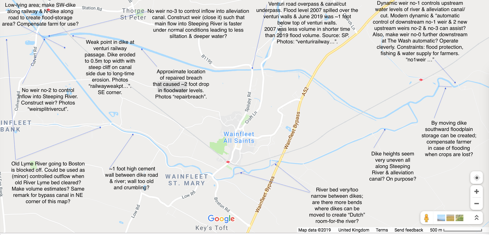

*Figure.* Overview map of the area, River Steeping and alleviation/relief canal around Wainfleet All Saints. North is upward. A distance scale is found bottom-right. We may be able to illustrate effect of dynamic weirs and "natural dredging" in a model set-up, invented by Wout Zweers and Jan-Jaap, and further enhanced by me.

----

# The story of Wetropolis' flood demonstrator

**_Mathematical/numerical design_**. While compilating the design files, we searched through our emails. A chronological account shows how the Wetropolis idea gradually grew to a definite design in a series of communications with Wout Zweers and visits to Wowlab as well as to two or three presentations:
- The presentation "Managing Risk in an Age of Extremes" at the Science of Flood workshop on May 8th 2016 in Hebden Bridge --see the file hebdenbrigde2016 -copy.pdf Please notice the first design sketch (```1stsket```) on page 18 and that the final design became quite different.

- The presentation "On the Science of Floods: Rainfall, Flooding, and Flood Control revisited in the Design of a Table-Top Model" with the abstract developed in an email exchange with Dr Colin Cotter in which I promised a presentation and send him an abstract on 08-05-2015, before I had done any mathematical calculations. Talking about managing risk in the age of extremes!
- Note that the (in part raw) source material given below contains invaluable information on the design, which may be streamlined further at a later stage, but with the risk of losing some information.

**_Presentation at Imperial College_** 
"Sun 5/8/2016, 9:09 PM
Hi Colin, Would the following work for the June 1st seminar for MPE? (The abstract is a) Bit "experimental/preliminary" but I think I have enough for a good overview and discussion. Besides it coincides with the writing of the outline. Let me know your comments before I send it in, please. -Onno

Title: On the Science of Floods: Rainfall, Flooding, and Flood Control revisited in the Design of a Table-Top Model
By Onno Bokhove
Abstract: In a recent public event in Hebden Bridge, a town in Yorkshire that has seen a lot of sustained and flash floods over the last decade, I addressed the following questions:
- Is it going to rain more in the future?
- Can we define extreme precipitation and flooding events?
- How (well) can we predict heavy precipitation and floods?
- How (well) can we mitigate and control flooding?
I will elucidate the answers to the above questions and use them in the design and modelling of an interactive, conceptual table-top demonstration and experiment on rainfall, flooding as well as flood mitigation and control. The design will serve two purposes: as public demonstration of the concepts of flooding and as a simplified test environment for mathematical models of flooding with rainfall, hydraulics, hydrology, data assimilation and flood control. For the test environment, I will identify the mathematical elements involved to model "random" rain supply, channel/river flow, the hydrology of "Hele-Shaw valleys" (illustrating the effects porous moors, fast run-off from tarmac, and the function of reservoirs), flow in bypass canals, and control features such as weirs and sluice gates as well as data assimilation using a few measurement points. Obviously, this is work in progress."

- **_Mathematical/numerical design_**. Email Wout on 30-05-2106: *Maak ook maar zo’n model voor Twente. Er viel hier net 20 mm in 15 minuten. Zelfs de straat stond blank, ondanks de hoge ligging en vlak voor de keukendeur was het 5 cm diep water. En er komen nog een paar buien aan, wow!*
Please also make such a mathematical and numerical model for (rivers in the county of) Twente. Rainfall here a few minutes ago accumulated to 20mm in 15min. The street was flooded, despite its higher situation and in front of the kicthen door the water was 5cm deep. More rain is expected. Wow!

- **_Predesign_**. Email Wout 31-05-2016: *ik heb al materiaal gekocht. slang, klep, dik schuim, iets om detector mee te maken.*  Some materials have bought, in advance of the visit: tubing, a valve, thick foam, something to construct a waterlevel detector. Email Wout 04-06-2016: *Plaatje freesmodel*. The first design was on one foam plated with a DDR-style city. We routed it but it was abandoned since the channel and residence time was too short. See file (```Figovers''') overstromingsmodel-rendering-03.JPG
 A simple water level indicator and pump controller using arduino and a relay: https://youtu.be/JJllc2UXyt8

- **_Mathematical/numerical design_** Seminar on Wetropolis design 01-06-2016: 'On the science of floods: rainfall, flooding and flood control revisited in the design of a table-top model' at Imperial College on 01-06-2016, where the first completed mathematical and numerical desig model was revealed -see the file reading1J2016.pdf At this seminar, I (OB) ran the matlab simulation at the end of the seminar for 100 Wetropolis days, i.e. 1000s real time, which is about 100s computational time. While there should be 2.73 extreme events on average over 100 wd's, in that simulation it was not till day 99 that the first extreme rainfall event and flooding happened. Meanwhile I was babbling for 99s waiting for the extreme event to appear, meanwhile sweating buckets while fearing that I had set up the simulation incorrectly. Then on day 99, the last day in the simulation, the extreme flooding event flooded the city. "Did you keep us in suspense on purpose, had you arranged this extreme event to occur on the last day", I recall Prof Darryl Holm asking. "Sure", I said, and smiled: "I did not. I was fearing that something had gone wrong but, hey, that is probability". I have saved a screen shot of this simulation with one spike on wd 99. See, indeed, the file (```simu''') simulator11ic.jpg
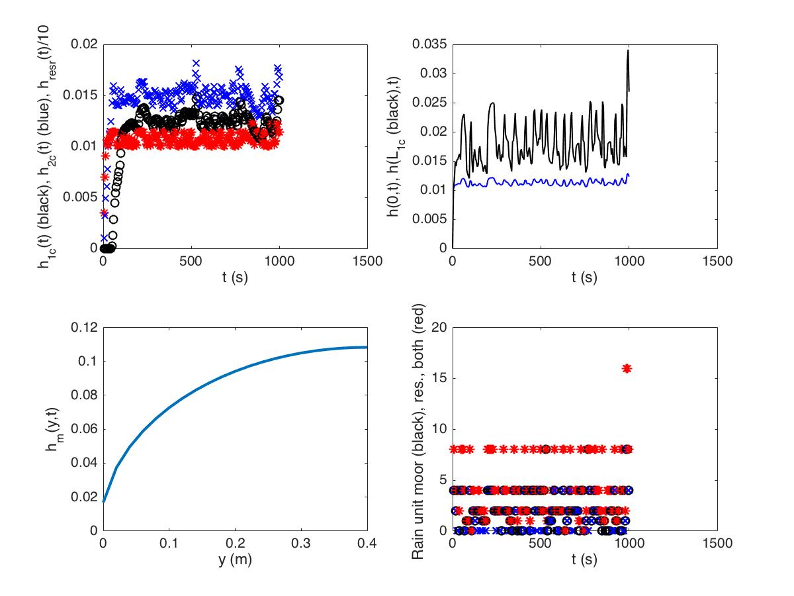

- **_Galton boards_**. The test results of the first asymmetric Galton board (email Wout 30-06-2016): *Ik heb de aantallen even opgeteld. Na 10 x 16 kogels laten rollen:*

| | links | midden links | midden rechts | rechts |
|-----|-------|--------------|---------------|--------|
| trial uitkomsten | 28 | 79 | 44 | 9 |
| kansverdeling | 30 | 70 | 50 | 10 |

*Dus dat ligt aardig in de buurt* Fairly reasonable.

I have added the outcome of Galton board after 10x16 trials with the steel balls, I obtained the following after 16x1 trials with the steel balls rolling down a Galton board:

|     | Left | middle left | middle right | right |
|-----|------|-------------|--------------|-----------|
|histogram of outcomes | 28      |     79     |      44      |     9  |
|actual distribution   | 30      |     70     |      50      |    10  |

So the test and exact outcomes are fairly close. Test 15-07-2016: https://www.youtube.com/watch?v=FR3QPHajcew&feature=youtu.be
 
- **_Polystyrene topography_**. Four drawings/excel files of 2016 base plates (Email 07-07-2016 Wout) all dated with "20160707" in the file name

- **_Wooden suport frame_**. 21-07-2016 email Wout: the wooden support frame is getting ready; JPG-files started with 210702016 *Transportabel: alles kan goed uit elkaar, worden latten met wat uitstekende klampen in een richting, dus goed te bundelen. Grootste lengte: 180cm lat met 8 m6-boutjes om het vast te zetten de latten grijpen in elkaar en worden met een boutje geborgd (zie foto). Gewicht: het is hout*. The support frame is transportable. Reporting on dimensions and weight in order to assess whether the construction fits in the back of a car -with the backseat folded down. Longest wooden slabs are 180cm with 8 m6-bolt-nut pairs. The weight is substantial since the construction is made of wood.

- **_Testing the pumps_**. Test of river pump on 08-01-206: https://www.youtube.com/watch?v=GVCFESyP-mU&feature=youtu.be
*filmpje met eerste water in model. Rivier stroomt over bij debiet 1040 l  per uur en water in stad staat dan tot de rand waar de uiterwaard begint. Ik ga er een (instelbaar) 220 v pompje voor halen, ik heb nu 3 stuks  12V pompjes nodig (op 14V, dat houden ze niet lang vol) om dit debiet  te halen. rondpompen gaat verder goed. Ik heb een retourpomp op 220V welke het uitgestroomde water oppompt vanuit een teil/emmer op de bodem naar de  bak waar de 12V pompen in hangen (zo min mogelijk opvoerhoogte, maakt  het voor de pompen makkelijker om voldoende debiet te geven). Het pompje zal regelbaar zijn, zodat we de gewenste hoeveelheid ook vantevoren in kunnen stellen.* Movie with first flow in the model. Discharge is 1040l/h for which discharge the water is nearly flooding the city. Three pumps of 12V are needed but aquarium pumps working on 220V may be required. Top view of river-flood model in a test with the pump supplying the river water on 01-08-2016: https://youtu.be/QiVPV9ntBt0  The seams between two foam plates and the aluminum tape sealing them is seen nicely in here *overstromingsmodel test rivierpomp cyclus 1 augustus 2016*: https://youtu.be/Hwd3rjfHjkE

- **_Rainfall on moor_**. Rain tests 04-08-2016: https://youtu.be/cTSCZrBgIYs (and more rain https://youtu.be/cTSCZrBgIYs), and tests Galton boards (with a routing error in the bottom one Galton board, note that is symmetric instead of asymmetric -later replaced): https://youtu.be/zMG5POaJsHE

- **_Testing the pumps_** continued. And comparing my calculations of rain supply with what was measured: *Mijn calibratie kwam uit op 0.94l in 10 sec. Calculation spot-on dus. Op 4-8-2016 om 15:18 schreef Onno Bokhove: 1, 2, 4, of 8 R0/s over 10s unit. In mijn model had ik 0.12, 0.24, 0.48, 0.96 liter over 10s, en dus over twee cellen kan dat zelfs 2x0.96 liter zijn. Edoch mijn model is slechts indicatief." Wout: "de pomp werkte bij 8V en gaf 336l per uur. Bij 12V, net ook even getest,  kom ik op 550l per uur. Net voldoende denk ik, want bij 1000 liter per uur stroomde bedding net niet over bij de stad. dit getal klopt wel zo'n beetje met de eerdere tests van de dompelpompje: rond 500 liter per uur maximaal. De pomp stond op 8V, ik kan continu bedrijf (12V)  max een half uur gebruiken. Mocht het toch te weinig zijn dan stap ik ook hier over op een 220V pompje, voor ongeveer 25 euro heb je ruime keuze in debieten en geen gedoe met hoog amperage voeding voor 12V. het wordt toch via een relais aan uit geschakeld.* The actual calibration led to 0.94l in 10s, while the model predictions in 2016 were 0.12, 0.24, 0.48 and 0.96l over 10s, so for two cells that would be 2x0.96l/10s, even though these were indicative numerical estimates. The pump gave 336l/hr at 8V, 550l/hr at 12V, which seems just sufficient since the city was about to flood at 1000l/hr. Possibly 220V pumps are needed, which indeed were eventually bought, the aquarium pumps.

- **_Material for moor_**. Wout 11-08-2016: *Vandaag hydrokorrels gebruikt (grote maat, kon in de stad geen kleine  krijgen), valt niet tegen. Het gaat niet opdrijven, blijft goed in de  vorm. Het stroomt wat snel door en de vertragende werking en bergingscapaciteit komen niet zo duidelijk naar voren, maar nalopen  nadat de regen stopt is wel duidelijk te zien. Het vult tot ongeveer 7  cm hoogte met water bij ingestelde debiet, daarboven is het onverzadigd. Ik denk dat ik morgen wat fijner materiaal ga halen bij een tuinzaak, in  de stad hadden ze het niet. Wel heel fijn materiaal (leisplit en zand) maar dat stroomt niet snel genoeg door en dan krijg je vooral runoff. Daarmee kan ik dan wat beter kijken naar de respons op een regenbui, karakteristieke tijd, waterweerstand van het geheel maar zo, op gevoel, werkt het ook al aardig. De kraan voor het instellen van het rivierdebiet werkt goed, ruime  variatie mogelijk. Voor het reservoir heb ik nu een bakje met 2.5 liter gebruikt, dat was voorhanden, maar lijkt een bruikbare grootte te zijn. Bij leeggieten en moor aan krijg je geheid een overstroming, als je het leeggiet en de moor staat niet aan / druppelt niet na dan loopt de rivier vol en overstroomt wel in de iuterwaard maar Leeds blijft droog. Beetje mee spelen dus, wat gevoel voor krijgen. Moor aan en reservoir overdoen  geeft een flinke overstroming, maar pas nadat de berging van de rivier met uiterwaard zelf ook gevuld is. Voor het reservoir wil ik ook een plexiglas bak lijmen, en er een flinke schuifafsluiter op zetten. Alternatieve materialen zijn overigens: glasparels (straalkogels) van  1.5 a 2 mm, keramische ringetjes (filtermateriaal voor koivijvers), kunststof straal grit (ongeveer 1.5-2 mm diameter).*
Final set-up:

Hydrograins of bigger size were used in the moor. They don't float. The through-flow seems perhaps too fast. The moor fills under 8s rainfall to a groundwater level of about 7cm, above which the ground is unsaturated. Much finer material such as loam and sand is too compact and leads mostly to run-off. Intermediate coarse material will be considered next. (In the end we chose lava-grains, for which the e-folding time is about 20s to 30s, so a few wd's). For the reservoir a 2.5l unit was used, with a valve regulating the flow into the river. Eventually a new plexiglass unit was made with two exits, one adjustable pipe for the river and one valve for flow into the canal. We can still explore the use of alternative materials for the moor: glass pearls, ceamic rings (for koi ponds), and plastic grit.

- **_Arduino boards_** The Arduino mother board was broken and patchy so a repair was underway. Wout 20-03-2017: *Er is een verandering: de stekkers aan de lintkabel zullen iets veranderd moeten worden. Het extra beugeltje wat de lintkabel terugbuigt moet bij drie van de vier stekkers worden verwijderd om te passen. Dat kan met een schroevendraaier of mesje, je kunt ze er zo afwippen. Ik had geen hoge maar lage chassisdelen meegenomen, niet aan gedacht. Zie foto* (```fotoboard2017```): *beugeltje (U-vormig) verwijderen, dan past de stekker onder de grendels. De aansluiting voor de relais (witte blokje met 4 aansluitpolen) is verplaatst op het bord, dat kwam beter uit.* There is a change for the plugs on the stripcables. The extra clips on three of the four stripcables need to be removed in order to fit. That can be done with a screwdriver or knife, to remove them. See the photo: remove the U-formed clip, then the plugs will fit under the locks. 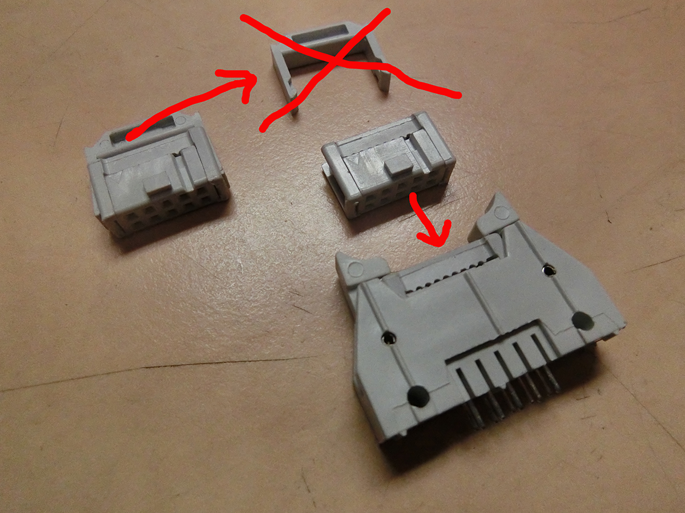 and also 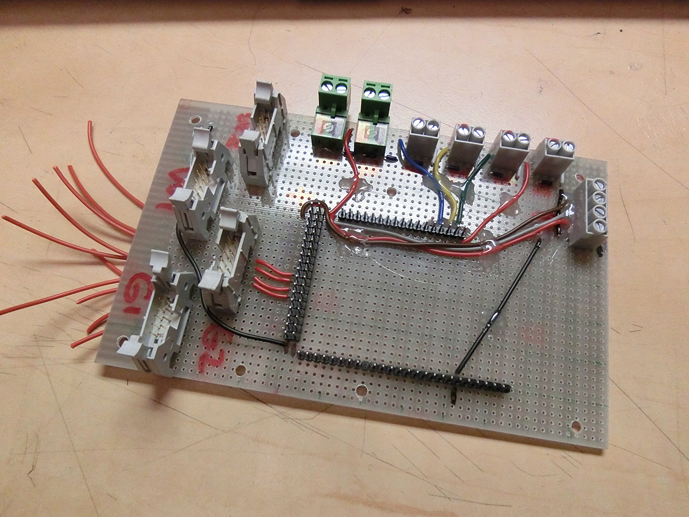 *Losmaken en verwisselen Arduino: Stroom er af! Neem de Arduino voorzichting van het oude moederbord, ik gebruik vaak daarvoor een kleine schroevendraaier welke ik in een kier tussen arduino en moederbord pinnen zet, draai de schroevendraaier voorzichtig wat het bord omhoog wrikt. Zorg dat het geleidelijk en recht omhoog komt door niet op 1 plek omhoog te wrikken, maar langs meerdere pinnen te gaan. Zo houd je de pinnen recht en heel. Plaats de Arduino boven de pinnen van het nieuwe bord. Controleer of alle pinnen recht zijn en goed tegenover de openingen van de arduino aansluitingen liggen. Het kan maar op een manier goed. Druk het voorzichting aan, niet in een keer de ene kant en dan de andere, maar afwisselend op verschillende plekken aandrukken zodat de Arduino gelijkmatig erop wordt gedrukt.* Removal and swapping of Arduino-boards: turn power off! Then carefully take the Arduino out of the old (partially broken) motherboard, perhaps by slipping a small screwdriver in te gap between Arduino and motherboard. Lift it off evenly such as not to bend the pins. Put the Arduino on the new motherboard taking care that all pins are and stay straight. There is only one correct way. Press gently alternatingly on different spots to get it on evenly, and/or readjust.

- **_Polystyrene topography, sand and varnish to roughen river base_** Instructions 20-02-2019: *leverancier: Welkoop schelpenzand, agri retailo Galvanistraat 100 Ede, verkoop via Welkoop. Schelpenzand bevat gecalcineerd zand en zeeschelpen (sand and shells) voor aanbrengen is het zand gezeefd met een huishoudzeef, maasopening ongeveer 0.9 mm (vierkante opening), draaddikte ongeveer 0.1 mm; zand is vastgelijmd in een vrij ruim opgezette laag matte PU lak. Aanbrengen: de kunst is een gelijkmatige laag te krijgen welke goed hecht. De lak werkt als lijm. Breng lak aan met een volle, platte penseel, werk met hanteerbare oppervlakken. Horizontaal en verticaal kunnen tegelijk worden gelakt. In de natte lak is een overmaat zand gestrooid, door het schuim te wentelsen en het zand heen en weer te laten schuiven is een gelijkmatige bedekking bereikt op horizontale en verticale vlakken. De overmaat zand van het schuim laten vallen door het schuim op de kop te zetten en hier lichtjes op te kloppen. Ga verder met het volgende deel. De vorm is in gedeeltes bezand omdat het niet in een keer dik genoeg in de lak kon worden gezet zonder dat de lak wegvloeide (druipers of juist te dunne laag op verticale vlakken). Je moet dus vlot doorwerken en in een sessie het werk afmaken. Na bezanden en afkloppen de laag vooral niet aanraken tot deze droog is anders veroorzaak je klontjes welke niet meer vlak te krijgen zijn. Enige handigheid en vaste hand met de kwast is wel zo praktisch, maar het valt wel mee om een goede vlakke laag te krijgen op deze manier. 2-3 cm rand welke je later wilt aftapen (voor waterdichte verbinding) bij de overgang van het kanaal van ene naar andere schuim niet bezanden, tape hecht slecht op het zand en er zal water onder door lopen.* Supplier of sand-shell mixtire is the Dutch store Welkoop. The sand mixture was sieved with a sieve with holes of 0.9mm and wire thickness of 0.1mm. The sieved sand was glued on the Wetropolis river bed with PU varnish. It was applied as follows: key is to bring the varnish on in a homogeneous layer. The varnish works as glue and is brought on by  flat brush. Both horizontal and vertical surfaces were varnished at the same time. There is an abundance of sieved sand spread on the wet varnish. By dealing with the foam and shift the sand back and forth, one obtains a uniform layer. The excess sand is removed by turning the polystyrene foam upside down and by then tapping lightly on the foam. Persue this procedure one area after another. Several thin layers have been applied otehrwise the varnish starts dripping or the layer is too thin on the vertical faces. Work quickly and don't touch the layers befor ethey are dry otherwise one gets floculation. Near the edges of the riverbed to another foam a strip of 2-3cm is needed such that the aluminium tape can be taped on, so donot vanish and apply sands in this strip.

# Wetropolis Natural Flood Management 2017-2019
Of version 0 the base foam plates dissolved because water-soluable paint was used despite our warnings ... small showcasing at Maths Foresees network meeting January 2018. Cartoon of the entire Wetropolis set-up and its workings for an interim version of Wetropolis revisited with natural flood management. (```WetNFM```) 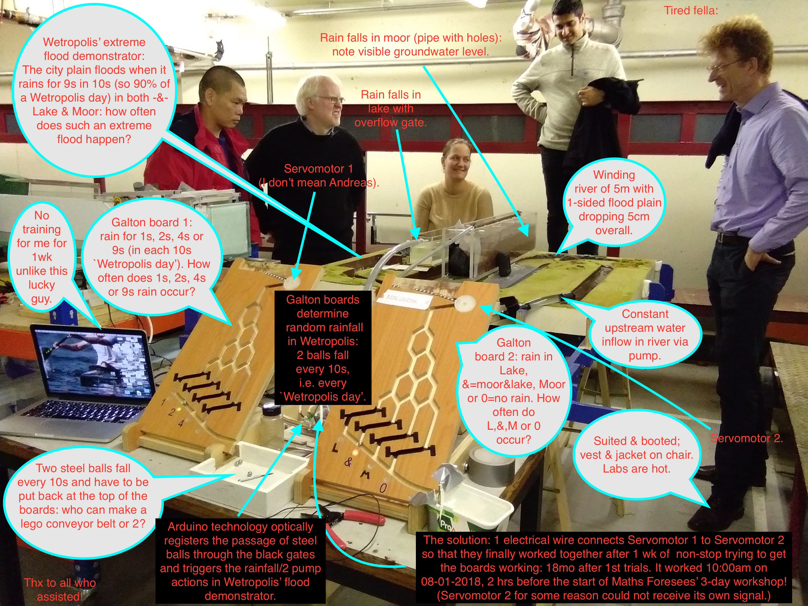

A design sketch (```WetNFM2```) is given of the Wetropolis flood demonstrator revisited to demonstrate principles of NFM: it contains a river section in the middle of the set-up in which the effects of inserts of different roughnesses --smooth, medium and very rough e.g. concrete, gravel and trees-- can be observed as well as an upstream catchment with oasis that can be shaped to contain smaller channel fed with streams that can be blocked with leaky match-stick dams. The latter oasis landscape can be molded by the public and hands-on experience with leaky dams, their effects and their failure can be tested. Courtesy: Alex Hinxman. 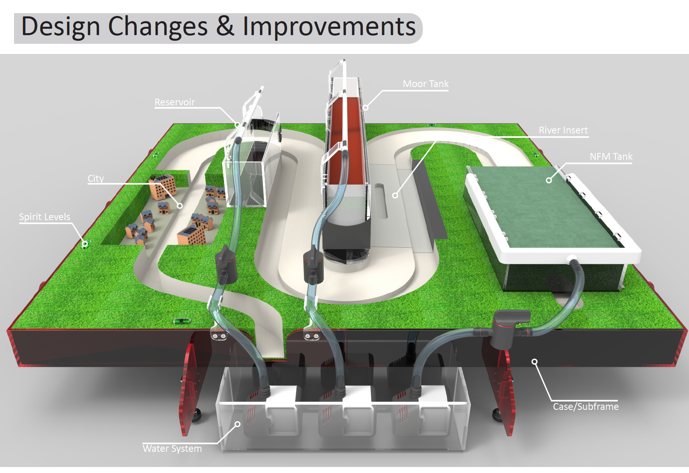

A new topographic base-plate design is made (with some glitches) using new CAD software, see 02-12-2018 file (```newbase2018```) 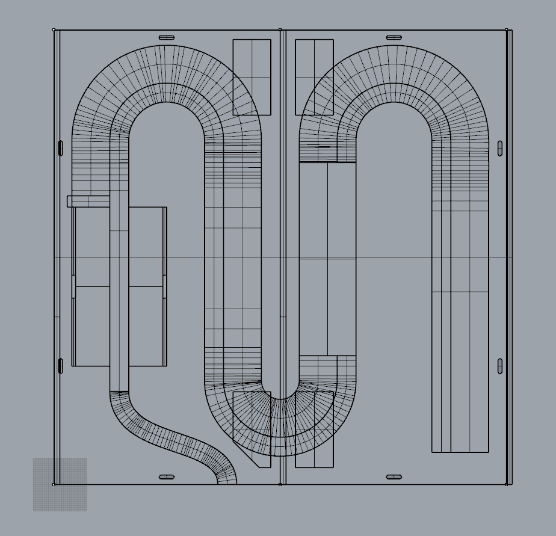
See also files starting 20180213 in folder topodrawings for several new design features: [topo2018](topodrawings/20180213overzicht1t10aanpassing.PNG)
New river and city plain cross section in (```crosscity```) on 13-02-2018: 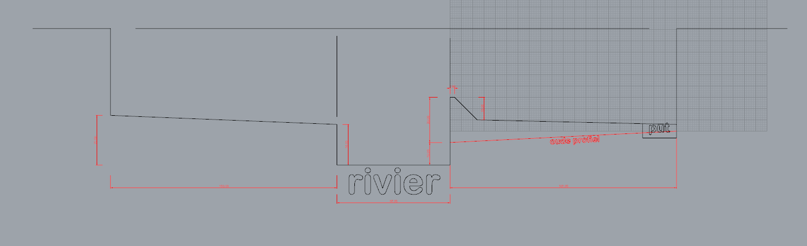

- **_Arduino board_** The folder ```arduinofile2018``` contains the Arduino codes for the 2018-design of the Arduino boards. New Galton board with four recirculating steel balls via a FisherTechqniue construction, a) front, b) back, and c) overview of new NFM topographic lanscape at Hydrotec Consulting (alas, the riverbed was not 1:100 but rather uneven so needs to be replaced) (```NFMwet2```): 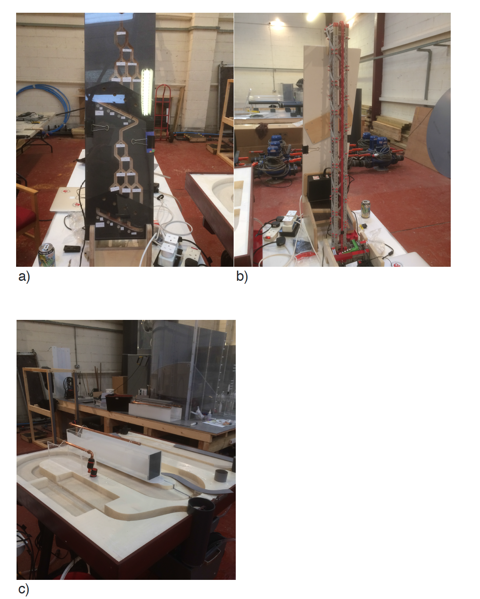

Detail of the new reservoir, aquifer and recirculation units: (```NFMwet3```): 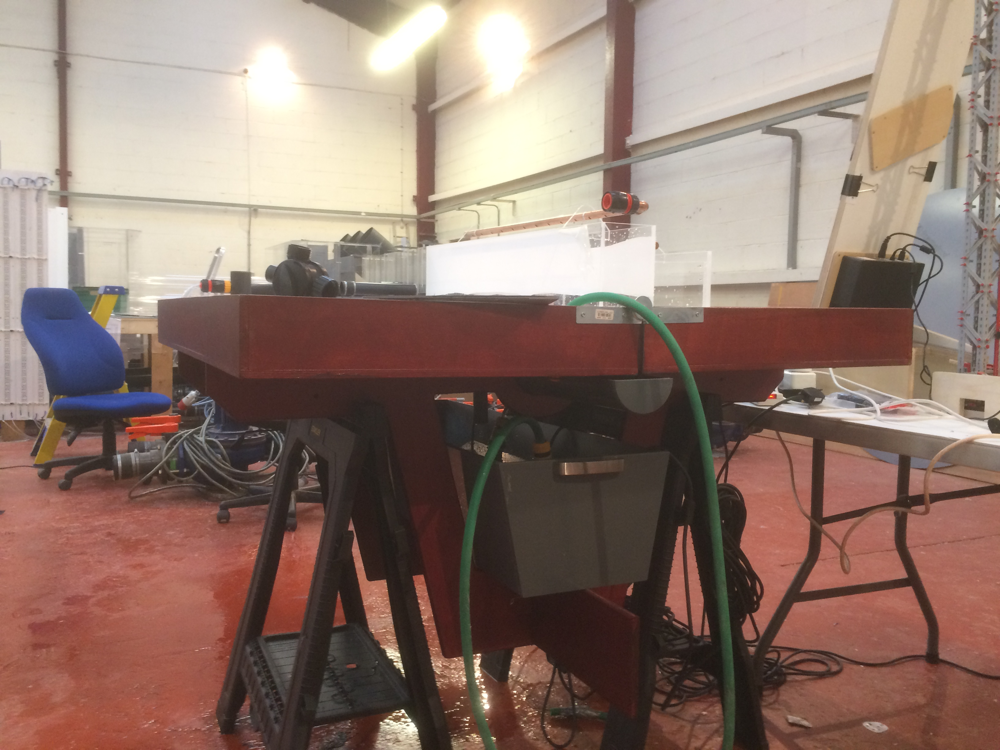


## Assessment of flood-mitigation plans near Bradford and Leeds
- Early 2021 a representation was officially submitted to Leeds City Council (LCC) by me on the flood-easing plans for Apperley Bridge (part of Bradford City Council BDMC); see file PlansApperleyBridgefloodeasingUpdate.pdf; note that I am a Bradford citizen and our local Bradford  city counsellor suggested to me to submit my queries as official representation.
- After numerous emails to LCC, LCC commented by email that it did not need to respond to the queries raised in my representation because legally it is not obliged to reply to representations from organisations which are not part of a specified list. (Note that this response is in direct conflict with LCC's code of conduct which states that LCC needs to be open to scrutiny and accountability, unless LCC's interpretation of what accountability means is "interesting".)
- Hence, my queries in the representation about:
a) the flood-defence walls possibly being more expensive than earthen walls [indicated by cost tables of JBA & EA as well as advice by a Civil Engineer working on River IJssel works (The Netherlands) & a railroad engineer; also steel prices are high due to the war in Ukraine such that the use of local soil/clay is especially preferred, if it was not already the case],
b) the funnel being created in front of the Apperley Bridge by these new walls, under climate change, leads to an equal and higher chance of flooding of the houses on the South side of the river and the flood plain & road on the North side (arguably walls for the flood plain on the North side should be lower or absent); furthermore, the increased water pressure due to the water levels heightened by higher walls increases the danger that the bridge collapses under the pressure; and,
c) the Haigh Beck catchment sewage-laden water being trapped in the neighbourhood next to the river because valves would block the polluted beck water from entering the River Aire, during high river levels; all these points (a,b,c) were not responded to and possibly ignored.
- A recent written official data-request inquiry (October 2022) at BDMC revealed that BDMC had given all rights to build flood-defence works on Bradford council soil to LCC and that BDMC could not be held accountable in that BDMC had no longer any say in the matter. Is that legal? BDMC refuses to say who within BDMC gave the BDMC rights away to LCC (I made an official data request asking for a clarification). BDMC also indirectlty admitted the oversight on (c) in that a consultant had been appointed by BDMC (info Oct 2022) to deal with the beck water flooding the Apperley Bridge neighbourhood next to the river, at high river levels (see also several posts of polluting events on my youtube & twitter channels: https://www.youtube.com/channel/UCgtjNTlzp0hZQznFAaF92WQ). Note that (one person of) Yorkshire Water (YW) has asked me to report pollution incidents of Haigh Beck.
- Recent inquiry with Yorkshire Water (October 2022) also revealed that LCC & BDMC had "forgotten" to include Haigh Beck floods from the flood-protection works in 2017-2021, except that I had warned them about the issues both in 2020 and officially in 2021.

- Note that the first October 2018 comment at the bottom of https://westleedsdispatch.com/government-flood-defence-proposals-kick-in-teeth-for-kirkstall/ led (one high-ranking person of) LCC and (one high-ranking person of) UoL to submit complaints against me and my team, which led to warnings, also in writing, by management (see also the Bokhove et al 2020 article in Water, which backs up that there are, verbally admitted, inconsistencies in LCC's flood-mitigation plans --needless to say we first asked LCC for comments and got none before any reports were made public (LCC and consultant expressede no interest); also the final articles in the journals Water and River Research were in the end commented on by LCC's consultant but next to nothing had to be added since the articles were correct). After the REF impact case was largely finished I suggested (Sept. 2020) to UoL management and HR two options: (i) to either punish me and my team for the "crimes" committed (according to the complaints by 1 person of LCC and 1 person of UoL --note that the complaints by LCC were backed up by a team of engineers, a board member within LCC and the local EEA lead as well as a consultant) or (ii) to fully and in writing take away the warnings (which was done only and reluctantly without any apology to me and my team after I involved and was advised to involve the union). In addition, I had put in a countercomplaint rebutting the complaints by LCC and (one person of) UoL, in Jan 2021, with the request to investigate the procedure to prevent putting pressure on researchers based on false complaints, especially stressing the importance that such pressure strangles the discussion on the -in-the-UK-much-needed- sustainable flood-protection works. To date (30-11-2022) UoL refuses to deal with this request, in fact, has verbally rejected the request and stiffles all discussion on the issue. Regarding all written and verbal informal (Sept 2020, January 2021, May 2021, November 2021, etc.) and formal complaints (July 2022) I have submitted, the UoL protocols thereon are factually ignored (to date 30-11-2022). Academic freedom and freedom of expression are seemingly meaningless concepts when high-ranking people decide otherwise? Note that the research found in our reports, articles and REF impact case reflect the efforts of an international team (from UK and France, Europe), with the REF case having a UKRI score of at least level 3 (out of 4), since our work is and has been used in practice. Of course, management invited me (by email) to put in a formal complaint if I did not agree with their mostly verbal statements/response. So I did, by invitation. To date, as far as I know, the formal complaint of July 2022 disappeared, with delay tactics being an effective mechanism. My first complaint has a simple resolution, and such a resolution suggestion is mandatory: to provide me with the notes of the verbal conversations that took place, which request according to written regulations is allowed, should be complied with; notes about informal verbal complaint discussion should be made and sent out as standard practice, certainly when requested.

Why would one be so foolish to analyse council flood-mitigation plans? I called the flood-evacuation of Leeds' Crossfit gym in Kirkstall on Boxing Day 2015. We arrived late at 15:00 on 27-12-2015 since nobody in Leeds had a key and the owner Mike had to come from Redcar. The water had entered the premises around 12:30. We worked hard to bring the gym equipment upstairs or place it on the pull-up racks. At 18:00, I called an end to the evacuation, see the photo below, since the water-level was still rising and Mike took the group photo. Wading back through hip-deep fast-flowing waters of the torrent that once was Kirkstall Road left a deep impression on us. It made me wonder whether the flood damage could have been prevented and why the flood plains were build-up with businesses the way they are. Logically, I then looked into the flood-allevation plans from LCC of 2017 onwards. We saved 20000 pounds of gym equipment that Boxing Day and Mike kindly gave a statement how my call and impromptu flood-evacuation plan had mattered, see the REF impact-case study. The rest you know.

Would I do it again, given all the harassment I have faced and continue to face via work and councils? That is a good question. After all, it is more peaceful to do exactly nothing and be part of the silent majority.

Xmas party response of a colleague who I told the above was: "Ad hominem".

See also Gramham's hierarchy of disagreement, aslo including "responding to tone", both in "rather than addressing the substance of the argument itself":
https://en.wikipedia.org/wiki/Paul_Graham_(programmer)#/media/File:Graham's_Hierarchy_of_Disagreement-en.svg

and

https://en.wikipedia.org/wiki/Paul_Graham_(programmer)#Graham's_Hierarchy_of_Disagreement

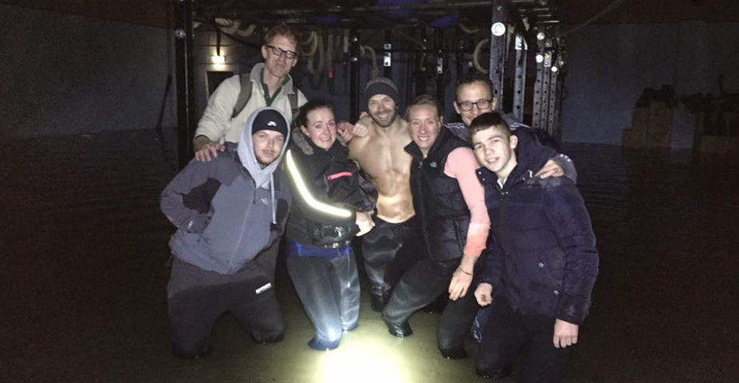


