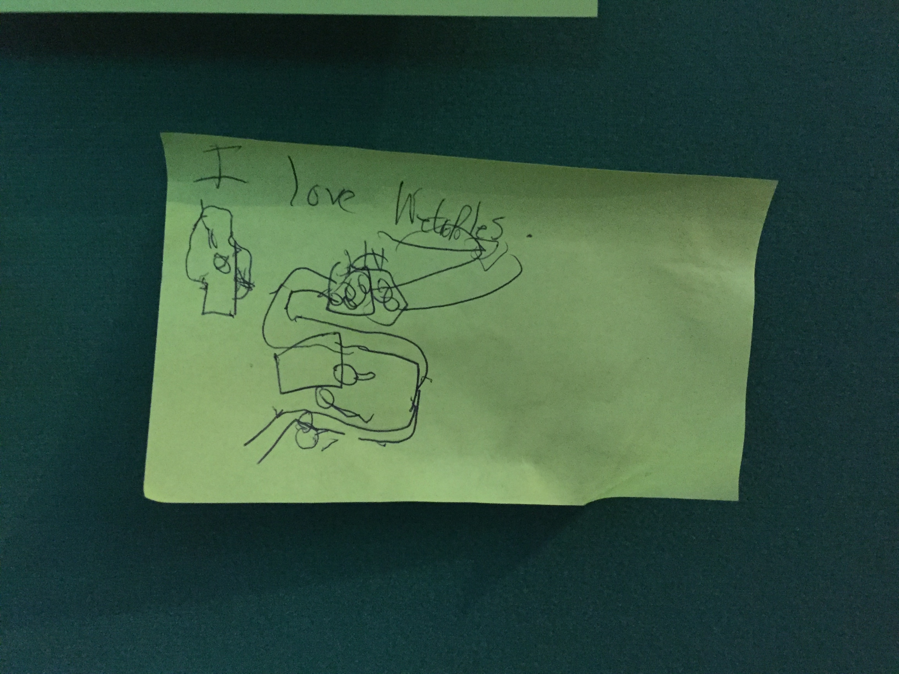
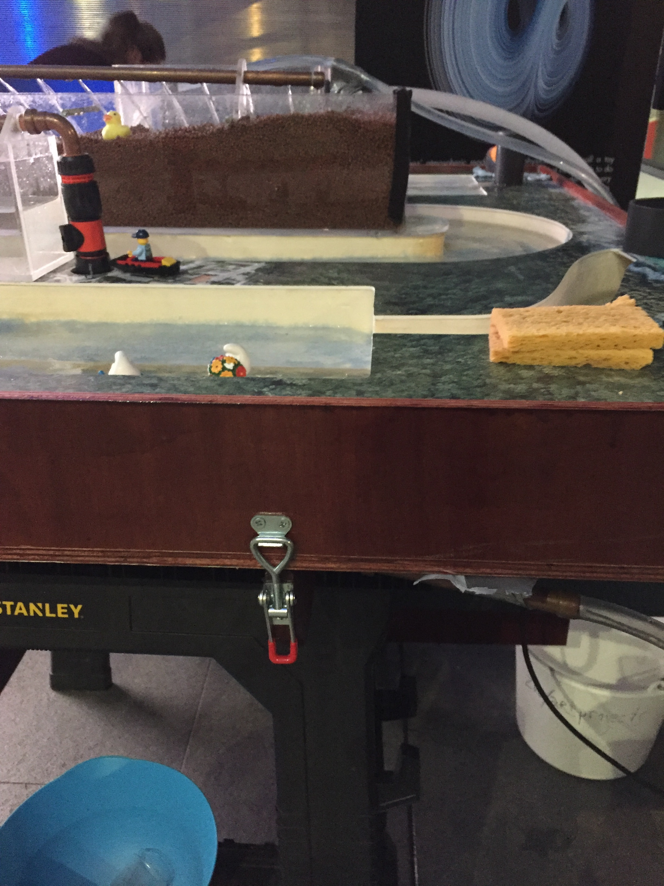
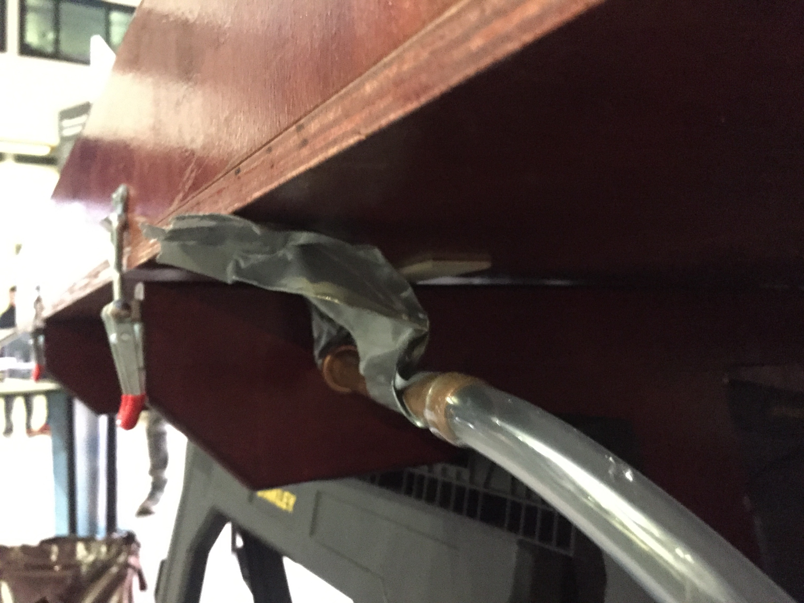

# Wetropolis I & II feedback

Scroll down for showcasings at: 1) Churchtown, 2) Leeds' Armley Museum, 3) Cambridge, and 4) Imperial College (and upcoming showcase at Sheffield "Flood modelling and forecasting challenges in industry workshop" 11/12-06-2020). Well over 700 people have now experienced what a return period is for an extreme flood with Wetropolis.

## 1. Wetropolis I: Feedback from Churchtown Flood Action Group 21-12-2019
The Churchtown Flood Action Group won the Environment Agency Project Excellence Award in 2018 and is the foremost Flood Action Group in Lancashire.

"Dear Onno, 

Obviously I would like to help you in any way that I can. When you gave your talk at the original Conference [January 2017] that I organised, I thought, despite its complexity you made it understandable through the use of the Westropolis model. But I only have GCSE Maths, so I just couldn’t understand the more complex calculations. I think I got the gist of your talk about Risk. I did learn from your talk that modelling is not an exact Science, because there are so many variables, to take into account. It is obvious that any system that makes the calculation of the risk of flooding more accurate is to be desired, especially in the present climate, when the flood risk assessments are in the hands of the people who produce them for their own use. The people who critiqued your article obviously have a greater understanding of what you are doing than I do. I am presuming that the Scientific Journal will not accept your article without some adjustments? 
The feedback that I have had from lay people is that your talk was enjoyable and the Wetropolis demonstration was interesting and informative. 

Regards, Siriol"

(Vice Chairman of Churchtown Flood Action Group. Administrator of Lancashire Flood Action Groups.) 

(```Photo via Siriol Hogg```) 

Video on Churchtown flooding: https://www.youtube.com/watch?v=il84G9XlS94

*Reaction*:
- Modelling is a(n exact) science. However, due to the chaotic nature of weather prediction and lack of uncertainty in the input parameters, as well as insufficient measurements and measurement erors, predictions have (a large) uncertainty, certainly long-term and climate predictions. Modelling is the science that includes dealing with such uncertainty.
- Indeed, publication in journals is an iterative process and in revisions one can address comments of the reviewers.

## 2. Wetropolis I: Feedback from Leeds Armley Museum 03-01-2020
“Wetropolis was utilised at a science event at Leeds Industrial Museum to complement an exhibition reflecting the community’s experience of the 2015 floods in the city. Being able to show the public how the flood occurred through the Wetropolis model certainly assisted the layperson’s  understanding of how the flooding occurred, making the mathematics of flooding accessible to a wider audience.”
Chris Sharp, Assistant Community Curator, Leeds Industrial Museum.


## 3. Wetropolis I: Feedback from Turing Gateway 28-12-2019
Wetropolis was displayed during the Environmental Modelling in Industry Study Group (April 2017 at the Isaac Newton Gateway to Mathematics in Cambridge) https://gateway.newton.ac.uk/event/tgmw41 with the following feedback “... the addition of the Wetropolis flood demonstrator on Wednesday attracted a lot of attention and interaction”. Jane Leeks from INI Gateway.


(```Photo via Turing Gateway```) <!---->

## 4. Wetropolis II: Feedback Mathematics of Planet Earth Exhibition 15-02 to 23-02 2020



Learn more about "Planet Earth is alive: using mathematics to understand and protect our world", including "A day in the world of *Wetropolis*", written by Claudia Cannon: www.imperial.ac.uk/news/195539/planet-earth-alive-using-mathematics-understand/
There were on average more than 50 visitors per day, and often many more, so over 9 days circa 450 to 1000 visitors came to the exhibition.

Comments made on the feedback board; a big thank you to all feedback providers for the feedback below [*reply by OB=Onno Bokhove*]:
- Just awesome. Smart. Intuitive. Fun.
- I love Wetropolis. [*OB: See photo of drawing above by someone who played for an hour with Wetropolis and took 5 videos.*]
- I think this exhibit is great. Could you add a way to force a flood made with difffently weighted marbles/blocks in the marble path?! Would be funny to see -flood. [*OB: We are in the process of making a Galton board out of Lego, which would make different channel options easier to make/modify by the public. Different size/weight marbles would not make a difference since the pass-through is registered optically.*]
- This exhibit is very cool but could (you) also simulate tsunamis? 9 second moor/res for the win. [*OB reply: Our coastal wave-tank in Leeds can illustrate overtopping by coastal waves and inundation by tsunamis.*]
- Brilliant visual & practical demo of flooding. Thank you.
- Really nice model of flood control, I like how everything is presented and I learned some new things too.
- Brilliant! So clear & captures the concept of chance in weather systems.Please construct more. [*Reply OB: the full and open design is found on this GitHub site and anyone is free to build a bespoke Wetropolis. Given lack of funding of outreach by UK funding agencies and universities, we are unable to build more ourselves.*]
- Wondering if bringing back the population of beavers is the most effective! Living in Dartmoor -the moor has it. [*OB reply: alas, no, their effect is much too small; see "Using flood-excess volume to show that upscaling beaver dams for protection against extreme floods proves unrealistic".* https://eartharxiv.org/w9evx/ ]
- Fantastic flood demo!! Great to show the different mesures to combat floods -for the perolation could you have two different"sands" with different percolation rates? Very well demonstrated and explained (smiley face). [*OB reply: yes, that can be readily arranged but we did the simple and more transportable case first.*]
- More beavers please. [*OB reply: see comment and link above.*]

14-02: Big pump breaks down. Works intermittently. Replaced on 21-02.

17-02: Small old pump breaks down; replaced on 19-02.

21-02: Replacement small pump breaks down; not yet replaced but reserve pump is providing water in upstream reservoir in sinc with the random supply of water in the moor. Galton board pretty level.

22-02: All is well but some fine-tuning, see further down for instructions.

23-02: Some fine-tuning, see further down for instructions.

Comment board (click to enlarge) and photos set-up:

 

<!--  
-->


## Instructions on how to run Wetropolis

Pointers for its smooth running on site for "wardens":
- Use the Raspberry Pi to run the serial monitor, on which one can check the collected outcomes of the two Galtonboards; if to far of and/or out of phase please check the levelness of the board with the water level. By closing and opening the serial monitor, the count starts again. Open folder on desktop (top, second/last one on right), click on Arduino file; when open click on tools and then in menu on serial monitor. E.g., on 21-02-2020 the 4th channels on (Galton Board 1) GB1 had 60 counts and GB2 had 120, while they should roughly be the same; after using the water level I saw the board was not level; I took a peg aay, restarted the Raspberry Pi and teh count after a while was 32-32.
- Check at times whether the water level in the main reservoir is submerging the pumps; the water also cools the pumps, which otherwise burn out. Use the bucket to refill (usually half a bucket suffices).
- Check at times whether the city-overflow collection bin is full, or not, and empty when full into the main reservoir.
- A pump to the upstream reservoir can be sinced with  the moor for extra peak flow, say under climate change, this option can be turned on or off; in either case check whether 9s of rain in both moor and city reservoir leads to a flood. If not or if too much water, turn the main water supply in the top of the river down or up. Then check again.
- Check whether 9s in moor and city reservoir gives a city flood: further fine tuning is possible by loosening the clamp near the city and putting a wooden peg underneath! See fine-tuning below.
- When a duck floats in the drain to the reservoir at the end of the river it may block the pipe. So please unplug when that happens.
- There need to be four steel balls in the running; there are extra smaller ball in the grey tool bag.
- All attendants/wardens: well done, good luck and enjoy.

Extra pointers:
- Grey tool back (in one of boxes behind the scenes) contains tools.
- When an exhibition goes on longer than one (half) day, then please cover the river set-up with the blanket and the sockets and Raspberry-Pi associated with the Galton board with the bubble wrap provided.
- Bring extra replacement pumps.
- Packing up: the entire set-up fits into the back of Kia with back seats folded down.
- Make a feedback board; collect feedback given directly.

Fine tuning:
- To obtain flooding evenly in the city one needs to observe the extreme case with 9s out of 0s rain in both moor and reservoir(s); to have flow over the dike evenly, one may need to level the last bit of the set-up by loosening the clamp near the city and if nbeed be put a small wooden bit or peg between support and the Wetropolis wooden frame. See photos below. This requires "Fingerspitzengefuhl" i.e. some intuition and trial-and-error. 
- When the above does not work, more water is needed, so turn up the flow with the anlogue valves, and when there is too much flow turn them down, till you observe that it works. There is a climate-change setting, in which both more and a far-upstream reservoir are both peratig in since and a normal set-up with the upstream-reservoir not in operation, via simple swictch.

 

Notes, future work:
- sockets should be in one shielded box;
- extra cover on back of Galton-board set-up/marble run;
- fix drainage city, use screw fittings and water collection box, with two valves (one in measurment device and one into reservoir) 
- secure drain pipes (one below seam and one at end of river);
- buy small toy houses;
- add switch board with several cases: normal one, climate one, extra flooding one, drought one, climate and drought and let audience analyse by observation which one is on. Do maths and progam options in Arduino;
- make Arduino graphs;
- make matching simulations and DA etc, with associated display; and,
- buy small houses for display in the city; make/buy houses on stilts with a gangplank to higher grounds in the flood plains.

## 5) Wetropolis II:  Flood modelling and forecasting challenges in industry workshop 11/12-06-2020 upcoming

Flood modelling and forecasting challenges in industry workshop https://twenty65.ac.uk/events/flood

